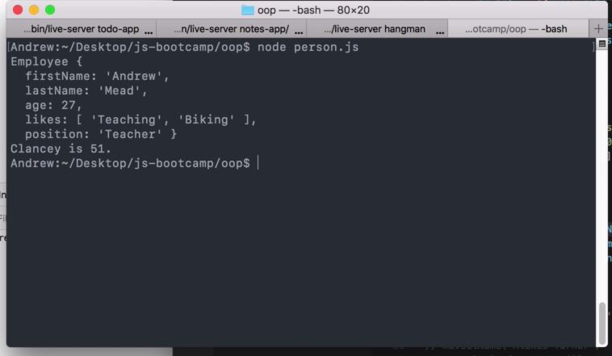
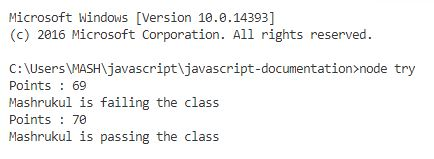

# Understanding Classes in JavaScript
Previously, we created Constructor Function and Prototype in JavaScript
```javascript
// Constructor Function
const Person = function(firstName, lastName, age, likes = []){
    this.firstName = firstName
    this.lastName = lastName
    this.age = age
    this.likes = likes
}

// Prototype : getBio
Person.prototype.getBio (){
    let bio = `${this.firstName} is ${this.age}.`
    
    this.likes.forEach((item){
        bio = bio + ` ${this.firstName} likes ${item}`
    })
    return bio
}

// Prototype : setFullName
Person.prototype.setFullName(fullName){
    const names = fullName.split('')
    this.firstName = fullName[0]
    this.lastName = fullName[1]
}
```
The same can be written in JavaScript Class

```javascript
// class
class Person {
    constructor(firstName, lastName, age, likes = []){
        this.firstName = firstName
        this.lastName = lastName
        this.age = age
        this.likes = likes
    }
    getBio(){
        let bio = `${this.firstName} is ${this.age}.`
        this.likes.forEach((item) => {
            bio = bio + ` ${this.firstName} likes ${item}`
        })
        return bio
    }
    setFullName(fullName){
        const names = fullName.split('')
        this.firstName = fullName[0]
        this.lastName = fullName[1]
    }
}

```


## Creating a SubClass

```javascript
// subclass: Employee
class Employee extends Person{
    constructor(firstName,lastName,age,position,likes){
        super(firstName,lastName,age,likes)
        this.position = position
    }
    getBio(){
        return `${this.firstName} is a ${this.position}`
    }
    getYearsLeft(){
        return 65 - this.age
    }
}

// subclass: student 
class Student extends Person{
    constructor(firstName,lastName,age,points,likes){
        super(firstName,lastName,age,likes)
        this.grade = points
    }
    updateGrade(num){
        this.grade = this.grade + num
    }
    getBio(){
        const status = this.grade >= 70 ? 'passing' : 'failing'  
        return `${this.firstName} is ${status} the class`
    }
}
```

Creating an instance of Employee and logging the instance( *`me`* ) we get
#### OUTPUT:
```javascript
const me = new Employee('Andrew','Mead',27,'Teacher',['Teaching','Biking'])
console.log(me)
```


Creating an instance of Student and logging the instance( *`student`* ) we get
#### OUTPUT:
```javascript
let student = new Student('Mashrukul','Huque',26,69)
console.log(`Points : ${student.grade}`)
console.log(student.getStatus())
student.updateGrade(1)
console.log(`Points : ${student.grade}`)
console.log(student.getStatus())
```


